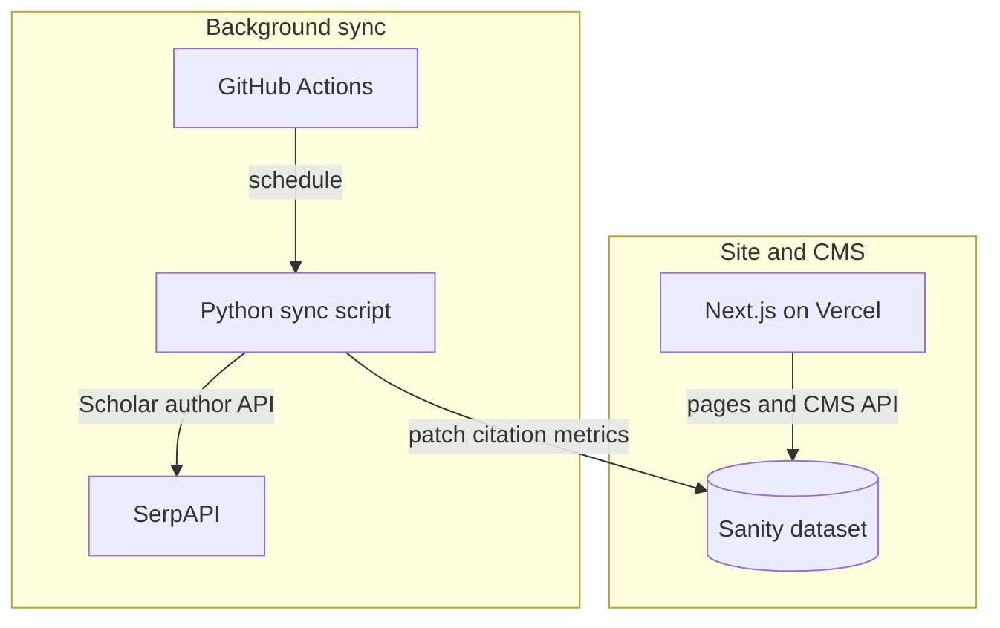

# Faculty Academic Portfolio

A full‑stack academic site for **Prof. Jitendra Kumar Samriya** at **IIIT Sonipat**, Haryana—profile, research, teaching, and contact in one place. Faculty update copy and files through a headless CMS (**Sanity**), so day‑to‑day edits do not need a redeploy. The live site runs on **Vercel**: [profjksamriya.in](https://profjksamriya.in).

---

## Architecture (high level)

**Sanity** holds the content; **Next.js** on **Vercel** talks to it for reads and a few server-side writes (visitor count, etc.). Scholar stats are different: **GitHub Actions** runs a small **Python** script on a schedule, calls **SerpAPI** for Google Scholar numbers, then patches `citations` / h-index / i10 on the profile in Sanity. That way we are not calling SerpAPI on every page view (rate limits and cost add up fast otherwise).



---

## What this project does

- **Public-facing pages** for biography, publications, books, conferences, PhD students, course assignments, study resources, and announcements.
- **Contact form** that sends email through the [Resend](https://resend.com) API.
- **Visitor count** stored in the CMS and updated once per browser session (so refreshes do not inflate the number).
- **Fresh content** from the CMS on each request (good for pages that change often).

---

## Why this stack

| Piece | Role |
|--------|------|
| **Next.js (App Router)** | Server-rendered pages, API routes, and routing in one project. |
| **Sanity** | Editors update text, files, and images in a dashboard; the site reads that data over the API. |
| **Tailwind CSS** | Consistent layout and styling without a separate CSS bundle to maintain by hand. |
| **Framer Motion** | Light motion for a more polished feel. |
| **Resend** | Reliable delivery for contact-form messages. |
| **Zustand** | Small client-side store for visitor count UI updates. |

The idea is a site a non-developer can keep fresh via the CMS, without giving up normal Next.js escape hatches (API routes, Vercel hosting) when we need them.

---

## Project layout (short)

- `app/` — Pages and layouts (home, about, publications, books, conferences, PhD students, assignments, resources, announcements, contact).
- `app/api/` — `contact` (email) and `increment-visitor` (visitor count).
- `components/` — Shared UI (navigation, footer, profile blocks, visitor tracking).
- `utils/sanity.js` — Sanity client, queries, and image URLs.
- `scripts/scholar-stats/` — Python job that refreshes **citations**, **h-index**, and **i10-index** on the Sanity `profile` via [SerpAPI](https://serpapi.com) (scheduled in GitHub Actions).

---

## Google Scholar stats (scheduled sync)

Citation metrics on the home profile live in Sanity (`citations`, `hIndex`, `i10Index`) and get refreshed by automation:

- **Workflow:** [.github/workflows/scholar-stats-sync.yml](.github/workflows/scholar-stats-sync.yml) runs on a **cron** (every 6 hours, UTC—good enough for numbers that do not move by the minute) and on **manual dispatch** (`workflow_dispatch`) when you want to force a run.
- **Script:** [scripts/scholar-stats/sync.py](scripts/scholar-stats/sync.py) uses SerpAPI’s official Python client (`google-search-results`) for `google_scholar_author`, then patches the profile via Sanity’s HTTP API with **`requests`** (pinned in [requirements.txt](scripts/scholar-stats/requirements.txt)).

### GitHub Actions secrets (this repository)

Add these under **Settings → Secrets and variables → Actions** (names must match exactly):

| Secret | Purpose |
|--------|---------|
| `SANITY_PROJECT_ID` | Sanity project ID (same value as `NEXT_PUBLIC_SANITY_PROJECT_ID`). |
| `SANITY_DATASET` | Dataset name (e.g. `production`). |
| `SANITY_API_TOKEN` | Token with **write** access to patch the `profile` document. |
| `SERPAPI_API_KEY` | [SerpAPI](https://serpapi.com/manage-api-key) key. |
| `GOOGLE_SCHOLAR_AUTHOR_ID` **or** `SCHOLAR_PROFILE_URL` | Author id (`user=…` in the Google Scholar profile URL) or the full profile URL so the id can be parsed. |
| `SANITY_PROFILE_DOCUMENT_ID` | Optional; if unset, the script uses GROQ `*[_type == "profile"][0]._id`. |

Secrets are **per repository**. If you previously used a separate `cron-jobs` repo, **copy the same values** into this repo’s secrets, run the workflow once to verify, then archive or remove the old repository.

### Local dry run

With Python 3.10+, install deps (`pip install -r scripts/scholar-stats/requirements.txt`) and set env vars. You may reuse `NEXT_PUBLIC_SANITY_*` from `.env` for project and dataset; see [.env.example](.env.example) for optional `SERPAPI_*` / Scholar variables.

```bash
export SANITY_API_TOKEN=... SERPAPI_API_KEY=... GOOGLE_SCHOLAR_AUTHOR_ID=...
python scripts/scholar-stats/sync.py
```

---

## Prerequisites

- **Node.js** (LTS recommended)
- **npm** (comes with Node)

---

## Local setup

1. **Clone the repository** and open the project folder.

2. **Environment variables** — Copy the example file and fill in real values:

   ```bash
   cp .env.example .env
   ```

   | Variable | Purpose |
   |----------|---------|
   | `NEXT_PUBLIC_SANITY_PROJECT_ID` | Sanity project ID (public, used in the browser). |
   | `NEXT_PUBLIC_SANITY_DATASET` | Dataset name (e.g. `production`). |
   | `SANITY_API_TOKEN` | Server-only token; needed for **writing** (visitor count updates). Keep it secret. |
   | `RESEND_API_KEY` | API key from Resend for sending contact emails. |

   The contact form sends mail to the **primary email stored in the faculty profile** in Sanity (not a separate env variable).

3. **Install dependencies** and **run the dev server**:

   ```bash
   npm install
   npm run dev
   ```

4. Open [http://localhost:3000](http://localhost:3000).

---

## Scripts

| Command | What it runs |
|---------|----------------|
| `npm run dev` | Development server (uses webpack as configured in this repo). |
| `npm run build` | Production build. |
| `npm start` | Serves the production build locally. |

---

## Deployment

The production site is hosted on **Vercel**. Add the same environment variables in the Vercel project settings. For **Resend**, use a **verified sending domain** that matches your “from” address in the contact API route.

---

## At a glance

- **CMS-first**: Faculty can update content without touching the codebase.
- **Not just static pages**: Contact form via Resend, visitor count with simple session-aware logic so refreshes do not inflate the number.
- **Structured content**: Separate Sanity types for publications, books, conferences, students, assignments, resources, announcements.
- **Stack**: React 19, Next.js App Router, Tailwind for layout.
- **Ops**: Sensible handling when CMS calls fail; images from Sanity’s CDN via Next config.

---

## Context & credits

**Faculty & institution.** This repository powers the public portfolio of **Prof. Jitendra Kumar Samriya** at the **Indian Institute of Information Technology (IIIT) Sonipat**, Haryana.

**Developer.** **Naresh Lohar** (CSE, IIIT Sonipat)—this repo is the codebase behind that public faculty site.

**License & reuse.** If you fork or reuse pieces of this, follow each vendor’s terms (Sanity, Resend, Vercel, SerpAPI, …) and keep secrets out of git.
